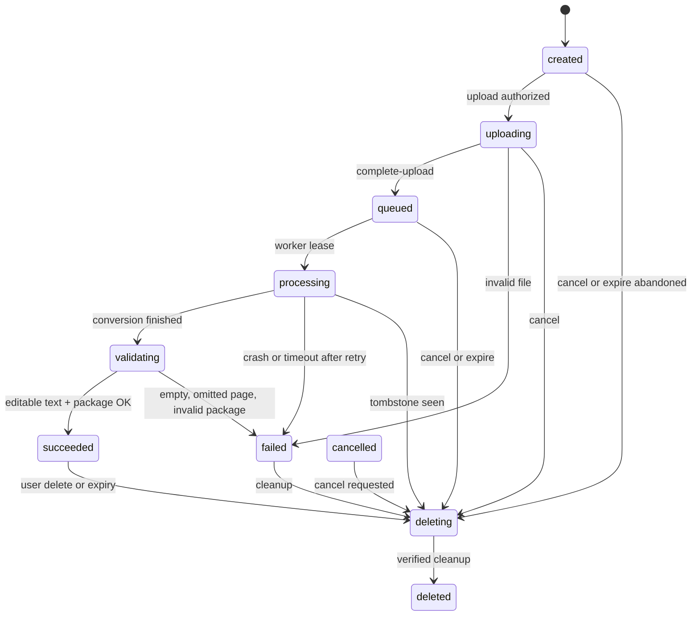

# Job state machine

Canonical states from [[Architecture]] and [[SPEC-API]].

## Rules

- Only a worker with a live lease may move `queued` → `processing` → `validating` → terminal success/failure.
- A tombstone wins. A worker that sees a tombstone must stop and not write outputs.
- `deleted` is shown to the user only after cleanup verification. See [[Deletion Contract]].
- Expired access returns a neutral unavailable result even if metadata still exists for the 7-day redacted retention window.
- Quota is counted once per logical job, including retries and repeated complete-upload calls.
